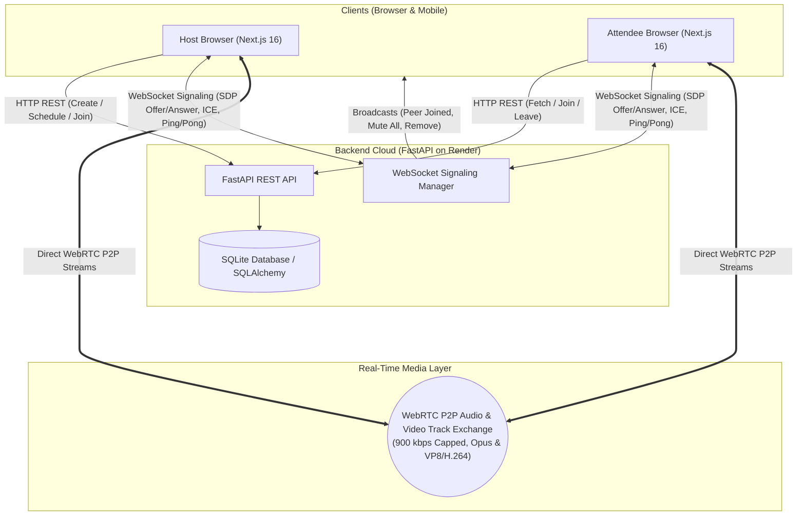

# Zoom Clone — Modern Real-Time Video Conferencing Platform

A full-stack, production-grade video conferencing web application inspired by Zoom Workplace. Built with **Next.js 16 (App Router & Turbopack)**, **FastAPI (Python 3.13)**, **WebSockets**, and **native WebRTC** for ultra-low latency peer-to-peer audio and video streaming.

[](https://nextjs.org/)
[](https://react.dev/)
[](https://fastapi.tiangolo.com/)
[](https://webrtc.org/)
[](https://www.sqlite.org/)

---

## 🌐 Live Deployments

- **Frontend Web Application (Vercel)**: [https://frontend-sable-rho-u2nzn8l17o.vercel.app](https://frontend-sable-rho-u2nzn8l17o.vercel.app)
- **Backend API Service (Render)**: [https://zoom-clone-xwp5.onrender.com](https://zoom-clone-xwp5.onrender.com)
- **Interactive Swagger API Documentation**: [https://zoom-clone-xwp5.onrender.com/docs](https://zoom-clone-xwp5.onrender.com/docs)
- **GitHub Repository**: [https://github.com/Kaartikkkk/Zoom_Clone](https://github.com/Kaartikkkk/Zoom_Clone)

---

## 🛠 Tech Stack

| Layer | Technology | Key Capabilities & Rationale |
|---|---|---|
| **Frontend Framework** | **Next.js 16.3 (Turbopack), React 19** | App Router, Server/Client components, dynamic routing (`/meeting/[id]`), zero-config TypeScript |
| **Styling & Design System** | **Vanilla CSS3** | Faithful Zoom Workplace 2025 light/dark theme, glassmorphism, responsive CSS grid, `100dvh` mobile viewport |
| **Real-Time Media (WebRTC)** | **Native WebRTC (`RTCPeerConnection`)** | Hardware-accelerated audio & video tracks, transceivers, 900 kbps mobile bitrate limits, ICE restart |
| **Real-Time Signaling** | **Native WebSockets (`FastAPI WebSockets`)** | Bi-directional SDP offer/answer exchange, ICE candidate routing, 5s keep-alive ping/pong heartbeat |
| **Backend Framework** | **Python 3.13, FastAPI, Uvicorn** | High-performance asynchronous REST API, dependency injection, CORS middleware, auto-generated OpenAPI |
| **Database & ORM** | **SQLite 3, SQLAlchemy 2.0** | Relational schema with foreign keys, cascade deletes, Pydantic v2 serialization, automated migrations |
| **Audio Processing** | **Web Audio API (`AudioContext`, `AnalyserNode`)** | Real-time frequency analysis for active speaker detection (waveform green ring indicator) |

---

## 🏗️ System Architecture



---

## 💡 Key Assumptions & Architectural Decisions

To ensure a seamless evaluation aligned with the assignment objectives, the following architectural choices and assumptions were made:

1. **Default User Assumed Logged In (Frictionless Evaluation)**:
   - **Assignment Guideline**: *"No Login Required: Assume a default user is logged in. Focus on the functionality rather than authentication."*
   - **Implementation**: The application loads with the default host user **Kartik** (`kartik@zoom.us`, Personal Meeting ID: `248-679-1350`) active by default across all views.
   - Evaluators can immediately create, schedule, or join meetings without being interrupted by mandatory login screens.
   - An optional Zoom-style Auth Modal (with 1-click **"Auto Fill"** demo credentials) and profile popover are available for full account management without imposing a barrier.

2. **Guest Attendees Supported Without Registration**:
   - Attendees can join any meeting directly via a shareable link or meeting ID without having to register an account.
   - The database schema reflects this by setting `participants.user_id` as **nullable**.

3. **Mesh Peer-to-Peer WebRTC Architecture**:
   - For ad-hoc team video conferencing without expensive third-party SFU/MCU licensing fees, direct WebRTC peer-to-peer connections (`RTCPeerConnection`) are established between attendees.
   - Deterministic offer/answer initiation (lower participant ID creates offer) eliminates WebRTC signaling glare.
   - Uses redundant public STUN servers (Google & Cloudflare) and TURN relay fallbacks for NAT traversal.

4. **Mobile-First Responsive Design (`100dvh`)**:
   - Standard `100vh` on mobile browsers causes the bottom toolbar to be obscured by browser address bars. The meeting room uses `100dvh` and CSS `env(safe-area-inset-bottom)` to guarantee toolbar visibility on iOS Safari and Android Chrome.

5. **Audio Decoupled from React Component Lifecycle**:
   - Video grids dynamically mount and unmount during layout changes. To prevent audio dropouts when participant tiles resize, remote audio streams are piped through persistent hidden `<audio autoPlay>` elements.
   - A global user-gesture audio unlocker automatically circumvents browser autoplay restrictions.

6. **5-Second WebSocket Keep-Alive (`ping`/`pong`)**:
   - Cloud reverse proxies (such as Render) and mobile cellular carriers aggressively terminate idle WebSocket connections after 30–60 seconds. A periodic 5s keep-alive heartbeat ensures signaling connections stay permanently alive.

---

## ✨ Core Application Features

### 1. 🏠 Landing Dashboard & Meeting Management
- **Authentic Zoom Workplace UI**: Search bar, live digital clock, day-of-week calendar selector, and user profile popover.
- **Quick Action Cards**:
  - 🟠 **New Meeting**: Instantly launches an ad-hoc room with a formatted 10-digit Zoom ID (`XXX-XXXX-XXXX`) and host privileges.
  - 🔵 **Join Meeting**: Connects to any meeting by Meeting ID or invite URL with custom display name pre-filled to `Kartik`.
  - 📅 **Schedule Meeting**: Opens the comprehensive meeting scheduler.
  - 🖥️ **Share Screen**: Shortcut directly into screen presentation mode.
- **Upcoming Meetings Carousel**: Filter scheduled calls by date (Today, Tomorrow, Future), duration badges, **Start**, **Copy Link**, and **Cancel** actions.
- **Recent Meetings History**: Review completed meetings with participant counts, timestamps, and durations via an integrated tab switch and historical log table.

### 2. 🎥 Real-Time Audio & Video Conferencing (WebRTC)
- **High-Definition Audio & Video**: Hardware-accelerated webcam and microphone capture via `navigator.mediaDevices.getUserMedia`.
- **Dynamic Gallery Grid**: Adapts automatically from 1 to 12+ participant tiles with avatar initial fallback when video is disabled.
- **Real-Time Active Speaker Indicator**: Web Audio API frequency analysis highlights the current speaker with a vibrant green border.
- **In-Meeting Controls Toolbar**:
  - 🎙️ **Mute / Unmute Microphone** with live audio waveform monitor.
  - 📹 **Start / Stop Camera** with avatar fallback.
  - 👥 **Participants Panel** toggle with live count badge.
  - 💬 **Meeting Chat** side panel for real-time text chat over WebSockets.
  - 👏 **Reactions** menu (👍, 👏, ❤️, 😂, 😮, 🎉, ✋ Raise Hand) with animated floating emoji overlays.
  - 🔗 **Copy Invite Link** button with instant clipboard feedback.
  - 🛑 **End / Leave Meeting** button (Host: *"End Meeting for All"*, Attendee: *"Leave Meeting"*).

### 3. 🛡️ Host Moderation Controls
- **Mute All**: Host can mute every participant in the room simultaneously via a real-time WebSocket broadcast, immediately shutting off remote mic tracks.
- **Remove Participant**: Host can eject any attendee from the call with a single click. The removed participant receives an immediate eviction notification and is redirected back to the dashboard.
- **Host Role Persistence**: Host status is preserved across page refreshes via browser session state.

### 4. 📅 Scheduled Meetings Flow
- Custom Meeting Title, Description, HTML5 Date Picker (restricted to present and future dates), Time Picker, Duration selector (15–120 min), and Timezone dropdown.
- Auto-generates an absolute shareable URL (`https://.../meeting/{id}`) stored in the database.
- Full meeting lifecycle: Launch, copy link, or cancel from the dashboard.

---

## 🗄️ Database Schema & Relational Design

The database is built on **SQLite 3** managed via **SQLAlchemy 2.0 ORM** models in [`backend/app/models.py`](backend/app/models.py).

```
┌─────────────────────────┐       ┌────────────────────────┐       ┌────────────────────────┐
│          users          │       │        meetings        │       │   scheduled_meetings   │
├─────────────────────────┤       ├────────────────────────┤       ├────────────────────────┤
│ id (PK, int)            │───┐   │ id (PK, int)           │───┐   │ id (PK, int)           │
│ name (str)              │   │   │ meeting_id (UK, str)   │   └───│ meeting_id (FK, int)   │
│ email (UK, str)         │   └──<│ host_id (FK, int)      │       │ description (text)     │
│ password_hash (str,nul) │       │ title (str)            │       │ scheduled_date (date)  │
│ avatar_url (str)        │       │ status (str)           │       │ scheduled_time (time)  │
│ personal_meeting_id     │       │ type (str)             │       │ duration_minutes (int) │
│ created_at (dt)         │       │ invite_link (str)      │       │ timezone (str)         │
└─────────────────────────┘       │ created_at (dt)        │       │ recurring (bool)       │
                                  │ started_at (dt)        │       └────────────────────────┘
                                  │ ended_at (dt)          │
                                  │ duration_minutes (int) │
                                  └────────────────────────┘
                                              │
                                              │ 1:N (Cascade Delete)
                                              ▼
                                  ┌────────────────────────┐
                                  │      participants      │
                                  ├────────────────────────┤
                                  │ id (PK, int)           │
                                  │ meeting_id (FK, int)   │
                                  │ user_id (FK, nullable) │
                                  │ display_name (str)     │
                                  │ joined_at (dt)         │
                                  │ left_at (dt, nullable) │
                                  │ is_host (bool)         │
                                  │ is_muted (bool)        │
                                  │ is_video_on (bool)     │
                                  └────────────────────────┘
```

### Relational Mapping
- **`users` $\rightarrow$ `meetings`**: One-to-Many (`hosted_meetings`).
- **`meetings` $\rightarrow$ `participants`**: One-to-Many (`cascade="all, delete-orphan"`).
- **`meetings` $\rightarrow$ `scheduled_meetings`**: One-to-One (`uselist=False`, `cascade="all, delete-orphan"`).
- **`users` $\rightarrow$ `participants`**: One-to-Many (`participations`). `user_id` is nullable to allow guest attendees.

---

## 📦 Sample Data Seeding

The database comes pre-seeded with sample records:

### 1. 👥 Team Users
All user passwords are encrypted using **PBKDF2 HMAC-SHA256** (`password123`):

| Name | Role | Email | Personal Meeting ID |
|---|---|---|---|
| **Kartik** *(Default User)* | Engineering Lead | `kartik@zoom.us` | `248-679-1350` |
| **Sarah Miller** | Staff Frontend Engineer | `sarah.miller@zoom.us` | `389-452-1920` |
| **Alex Chen** | Systems Architect | `alex.chen@zoom.us` | `512-680-4391` |
| **David Patel** | Director of Product | `david.patel@zoom.us` | `674-820-3158` |
| **Emily Rodriguez** | Senior UI/UX Designer | `emily.r@zoom.us` | `839-204-7164` |

### 2. 📅 Upcoming Scheduled Meetings
- **All-Hands: Q4 Architecture & Infrastructure Roadmap** (Today @ 16:30, 45 min)
- **Engineering Sync & Code Walkthrough** (Tomorrow @ 10:00, 30 min)
- **Design System & UI Components Review** (Day + 2 @ 14:00, 60 min)
- **Customer Feedback & Sprint Backlog Refinement** (Day + 4 @ 11:30, 45 min)

### 3. 🕒 Ended Recent Meetings
- **Sprint Planning & Retrospective** (Yesterday, 45 min, 4 participants)
- **Engineering Sync & Live WebRTC Demo** (2 days ago, 35 min, 3 participants)
- **Security Audit & Penetration Testing Review** (3 days ago, 50 min, 5 participants)
- **Customer Discovery & Technical Onboarding** (4 days ago, 25 min, 2 participants)

---

## 🔌 WebSocket Signaling Protocol

The WebSocket signaling server handles room presence and WebRTC SDP/ICE negotiation at `/ws/meeting/{clean_meeting_id}/{participant_id}`:

| Direction | Message Type | Payload Fields | Purpose |
|---|---|---|---|
| **Client $\rightarrow$ Server** | `ping` | `{"type": "ping"}` | Keep-alive heartbeat (sent every 5s) |
| **Server $\rightarrow$ Client** | `pong` | `{"type": "pong"}` | Heartbeat acknowledgment |
| **Server $\rightarrow$ Client** | `room-peers` | `{"type": "room-peers", "peers": [...]}` | Notifies newly joined client of active peers |
| **Server $\rightarrow$ Room** | `peer-joined` | `{"type": "peer-joined", "sender": "<id>"}` | Broadcasts new participant arrival |
| **Peer $\leftrightarrow$ Peer** | `offer` | `{"type": "offer", "offer": {...}, "target": "<id>"}` | WebRTC SDP offer exchange |
| **Peer $\leftrightarrow$ Peer** | `answer` | `{"type": "answer", "answer": {...}, "target": "<id>"}` | WebRTC SDP answer exchange |
| **Peer $\leftrightarrow$ Peer** | `candidate` | `{"type": "candidate", "candidate": {...}, "target": "<id>"}` | WebRTC ICE network candidate exchange |
| **Peer $\leftrightarrow$ Peer** | `chat` | `{"type": "chat", "text": "...", "senderName": "..."}` | Real-time in-meeting chat messaging |
| **Peer $\leftrightarrow$ Peer** | `reaction` | `{"type": "reaction", "emoji": "👏"}` | Real-time emoji reaction broadcast |
| **Host $\rightarrow$ Room** | `mute-all` | `{"type": "mute-all"}` | Disables microphone tracks for all attendees |
| **Host $\rightarrow$ Peer** | `removed-from-meeting`| `{"type": "removed-from-meeting"}` | Ejects target attendee immediately |
| **Server $\rightarrow$ Room** | `peer-left` | `{"type": "peer-left", "sender": "<id>"}` | Broadcasts participant departure |

---

## 📡 REST API Reference

### Meetings (`/api/meetings`)
- `POST /api/meetings/` — Create an instant meeting room.
- `GET /api/meetings/` — List all meetings (supports `status` and `type` filters).
- `GET /api/meetings/recent` — Fetch recent ended meetings with participant counts.
- `GET /api/meetings/upcoming` — Fetch upcoming scheduled meetings.
- `GET /api/meetings/{id}` — Get meeting details (supports formatted or unhyphenated ID).
- `PATCH /api/meetings/{id}` — Update meeting status (`active`, `ended`, `cancelled`).
- `POST /api/meetings/{id}/join` — Join meeting with a display name.
- `POST /api/meetings/{id}/leave` — Gracefully leave a meeting session.
- `GET /api/meetings/{id}/participants` — List active participants in a meeting.
- `PATCH /api/meetings/{id}/participants/{pid}` — Update participant mic/video state.
- `DELETE /api/meetings/{id}/participants/{pid}` — Host control: Remove participant from room.
- `POST /api/meetings/{id}/mute-all` — Host control: Broadcast mute command to all participants.

### Scheduling (`/api/schedule`)
- `POST /api/schedule` — Create a scheduled meeting with title, date, time, duration, timezone.
- `GET /api/schedule` — List all scheduled meetings.
- `DELETE /api/schedule/{id}` — Cancel a scheduled meeting by ID.

### Authentication (`/api/auth`)
- `POST /api/auth/signup` — Register new user with PBKDF2 hashed password.
- `POST /api/auth/login` — Sign in with email and password.
- `GET /api/auth/me` — Get current profile; gracefully defaults to host user without token.
- `POST /api/auth/logout` — Invalidate session.

---

## 🚀 Getting Started (Local Development)

### Prerequisites
- **Node.js**: v18.0 or later (`v20+` recommended)
- **Python**: 3.10+ (tested on Python 3.13)
- **Git**

---

### 1. Clone the Repository
```bash
git clone https://github.com/Kaartikkkk/Zoom_Clone.git
cd Zoom_Clone
```

---

### 2. Backend Setup
```bash
cd backend

# Create and activate Python virtual environment
python3 -m venv venv
source venv/bin/activate       # On macOS / Linux
# venv\Scripts\activate        # On Windows

# Install dependencies
pip install -r requirements.txt

# Start the FastAPI development server
uvicorn app.main:app --reload --host 0.0.0.0 --port 8000
```
- **API URL**: `http://localhost:8000`
- **Interactive Swagger Docs**: `http://localhost:8000/docs`
- *Note: The SQLite database (`zoom_clone.db`) is automatically initialized and seeded on first startup.*

#### Manual Database Seeding / Reset
To populate or reset the SQLite database with rich sample data at any time:
```bash
cd backend
source venv/bin/activate

# Seed sample data (if not already present)
python -m app.seed

# Or force-reset and re-seed from scratch
python -m app.seed --reset
```

---

### 3. Frontend Setup
In a separate terminal window:
```bash
cd frontend

# Install npm dependencies
npm install

# Start the Next.js development server
npm run dev
```
- Open [http://localhost:3000](http://localhost:3000) in your browser.
- The app will automatically connect to your local backend on port 8000.

---

### 4. Environment Variables (Optional)

#### Frontend (`frontend/.env.local`)
```env
NEXT_PUBLIC_API_URL=http://localhost:8000
NEXT_PUBLIC_WS_URL=ws://localhost:8000
```

#### Backend (`backend/.env`)
```env
DATABASE_URL=sqlite:///./zoom_clone.db
FRONTEND_URL=http://localhost:3000
```

---

## 🧪 Automated Testing & Audit Suite

The codebase includes an automated audit verification script that exercises all 10 core systems:

```bash
# Run the 10-point audit from the project root:
./backend/venv/bin/python scratch/audit_system.py
```

### Audit Coverage (10/10 Passed 100%):
```
=== STARTING FULL ZOOM CLONE SYSTEM AUDIT ===
✓ 1. Backend Health Check: OK
✓ 2. Create Meeting: OK (Formatted ID & Absolute URL)
✓ 3. Get Meeting Details: OK
✓ 4. Participant Management: OK (Host & Attendee Roles)
✓ 5. WebSocket Ping/Pong Heartbeat: OK
✓ WebSocket Initial Room-Peers Event: OK
✓ WebSocket Peer Joined Broadcast: OK
✓ 6. Host Controls - Mute All Real-time Broadcast: OK
✓ 7. Host Controls - Remove Participant Real-time Broadcast: OK
✓ 8. Scheduled Meetings Pipeline (Create, List, Auto-Link, Cancel): OK
✓ 9. Recent Meetings Section: OK
✓ 10. User Authentication (Signup, Login, Token, Fallback): OK

Overall Result: ALL 10 CORE TESTS PASSED 100%!
```

---

## 📂 Project Directory Structure

```
Zoom_Clone/
├── backend/
│   ├── app/
│   │   ├── __init__.py
│   │   ├── database.py             # SQLAlchemy engine & SQLite session maker
│   │   ├── main.py                 # FastAPI application, CORS, WebSockets
│   │   ├── models.py               # ORM Models (User, Meeting, ScheduledMeeting, Participant)
│   │   ├── schemas.py              # Pydantic v2 validation models
│   │   ├── seed.py                 # Comprehensive database seeder
│   │   ├── utils.py                # Zoom ID & absolute invite link generator
│   │   ├── websocket_manager.py    # Multi-room WebSocket connection manager
│   │   └── routers/
│   │       ├── auth.py             # Signup, Login, Me (PBKDF2 HMAC-SHA256)
│   │       ├── meetings.py         # Meeting CRUD, participants, host controls
│   │       ├── schedule.py         # Scheduled meetings CRUD
│   │       └── users.py            # User profile endpoints
│   ├── requirements.txt            # Python dependencies
│   └── zoom_clone.db               # SQLite database file
├── frontend/
│   ├── public/                     # Static assets, icons, Zoom logos
│   ├── src/
│   │   ├── app/
│   │   │   ├── globals.css         # Zoom Workplace design system & tokens
│   │   │   ├── layout.tsx          # Root layout with Plus Jakarta Sans & Inter
│   │   │   ├── page.tsx            # Dashboard (Quick actions, upcoming & recent cards)
│   │   │   └── meeting/[id]/
│   │   │       └── page.tsx        # Meeting room: WebRTC peer connections, video grid
│   │   ├── components/
│   │   │   ├── AuthModal.tsx       # Sign In / Sign Up modal with demo autofill
│   │   │   ├── ChatPanel.tsx       # Real-time in-meeting chat drawer
│   │   │   ├── JoinMeetingModal.tsx# Join meeting by ID or link
│   │   │   ├── MeetingToolbar.tsx  # Bottom meeting controls (mic, cam, reactions)
│   │   │   ├── Navbar.tsx          # Top navigation bar with profile popover & clock
│   │   │   ├── NewMeetingModal.tsx # Instant meeting configuration & link share
│   │   │   ├── ParticipantsPanel.tsx# Participants list with Mute All / Remove controls
│   │   │   ├── ScheduleMeetingModal.tsx # Meeting scheduling form
│   │   │   └── Sidebar.tsx         # Collapsible navigation drawer
│   │   └── lib/
│   │       └── api.ts              # Fetch API client, Bearer auth, route helpers
│   ├── package.json
│   └── tsconfig.json
└── README.md
```

---

## 📄 License
This project is open source and available under the [MIT License](LICENSE).
